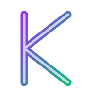
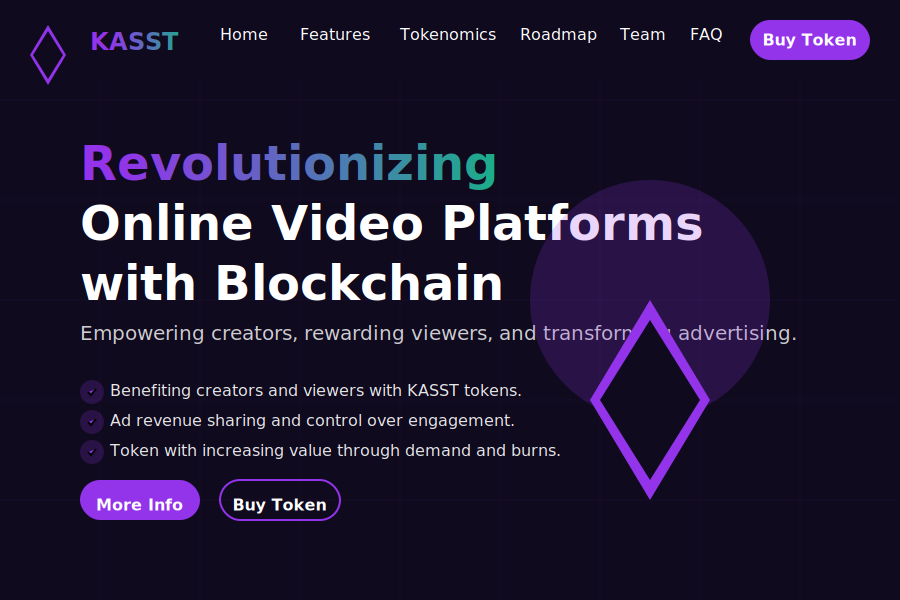

<div align="center">
  
  <h1>KASST - Revolutionizing Video Platforms with Blockchain</h1>

  <p>
    <a href="https://netlify.com">
      
    </a>
    
    
    
  </p>

  
</div>

## 🚀 Overview

KASST is a revolutionary blockchain-based video platform that empowers creators, rewards viewers, and transforms the advertising model. By leveraging blockchain technology, KASST creates a fair ecosystem where all participants benefit from the value they create.

Our platform addresses the key challenges in today's video platforms:
- **Creator Compensation**: Direct and transparent payment system
- **Viewer Rewards**: Get paid for your attention and engagement
- **Ad Revenue**: Fair distribution model with user control
- **Content Ownership**: True digital ownership through blockchain

## 💻 Tech Stack

<table>
  <tr>
    <td align="center" width="96">
      
      <br>Next.js 15
    </td>
    <td align="center" width="96">
      
      <br>React 18
    </td>
    <td align="center" width="96">
      
      <br>TypeScript
    </td>
    <td align="center" width="96">
      
      <br>Tailwind CSS
    </td>
    <td align="center" width="96">
      
      <br>Framer Motion
    </td>
  </tr>
  <tr>
    <td align="center" width="96">
      
      <br>Node.js
    </td>
    <td align="center" width="96">
      
      <br>Netlify
    </td>
    <td align="center" width="96">
      
      <br>Git
    </td>
    <td align="center" width="96">
      
      <br>ESLint
    </td>
    <td align="center" width="96">
      
      <br>Figma
    </td>
  </tr>
</table>

### Why This Tech Stack?

- **Next.js**: Server-side rendering for SEO optimization and fast page loads
- **TypeScript**: Type safety and improved developer experience
- **Tailwind CSS**: Rapid UI development with utility-first approach
- **Framer Motion**: Fluid animations and interactive elements
- **Netlify**: Seamless deployment with CI/CD integration

## ✨ Features

- **Interactive UI**: Engaging user experience with smooth animations
- **Responsive Design**: Optimized for all device sizes
- **Dark Mode**: Modern neon aesthetic with dark background
- **Performance Optimized**: Fast loading times and efficient rendering
- **SEO Friendly**: Server-side rendering for better search engine visibility
- **Accessibility**: WCAG compliant for all users

## 📋 Website Sections

- **Hero Section**: Captivating introduction to the KASST platform
- **Problem Statement**: Highlighting issues with current video platforms
- **Solution Overview**: How KASST addresses these challenges
- **Features Showcase**: Interactive display of platform capabilities
- **Token Information**: Details about the KASST token utility
- **Tokenomics**: Distribution and economic model visualization
- **Roadmap**: Timeline of development milestones
- **Team**: Profiles of the team behind KASST
- **Technical Overview**: Blockchain architecture explanation
- **Buy Token**: Easy token purchase interface

## 🛠️ Development

```bash
# Clone the repository
git clone https://github.com/Jeanfr1/KASST.git
cd KASST

# Install dependencies
npm install

# Run development server
npm run dev

# Build for production
npm run build

# Start production server
npm start
```

## 📁 Project Structure

```
k2s-website/
├── public/               # Static assets
│   └── images/           # Image assets
├── src/                  # Source code
│   ├── app/              # Next.js app directory
│   │   ├── layout.tsx    # Root layout
│   │   ├── page.tsx      # Home page
│   │   └── globals.css   # Global styles
│   └── components/       # React components
│       ├── layout/       # Layout components
│       └── sections/     # Page sections
├── tailwind.config.ts    # Tailwind configuration
├── next.config.js        # Next.js configuration
└── netlify.toml          # Netlify configuration
```

## 🚀 Deployment

This site is deployed on Netlify with continuous deployment from the main branch.

## 📄 License

All rights reserved.
